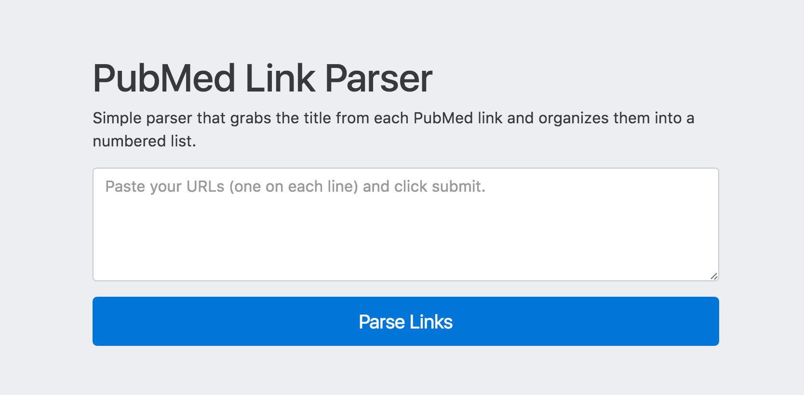

# PubMed Link Parser

The PubMed Link Parser allows you to enter one or more URLs from PubMed and grabs the results of the `<h1>` tag using the [Simple HTML DOM Parser](http://simplehtmldom.sourceforge.net/) library. The script currently dumps the results into numbered batches of thirty and includes an implementation of [Clipboard.js](https://clipboardjs.com/) to quickly copy the output batches to the clipboard for easy pasting into projects.

(This was created for a friend at [NutritionFacts.org](http://nutritionfacts.org))

## Version

1.0.0

## Requirements

PHP

## To Use

Upload to your web directory and open parser.php or fire up a local server for personal use.

Feel free to modify this to suit your needs. I wrote this pretty quickly, so there's probably a lot of room for improvement.

## To Do

Add in an Asana exporter.

### License

MIT

### Contact

[Christi Richards](https://christirichards.com)

[@christirichards](http://twitter.com/christirichards)
